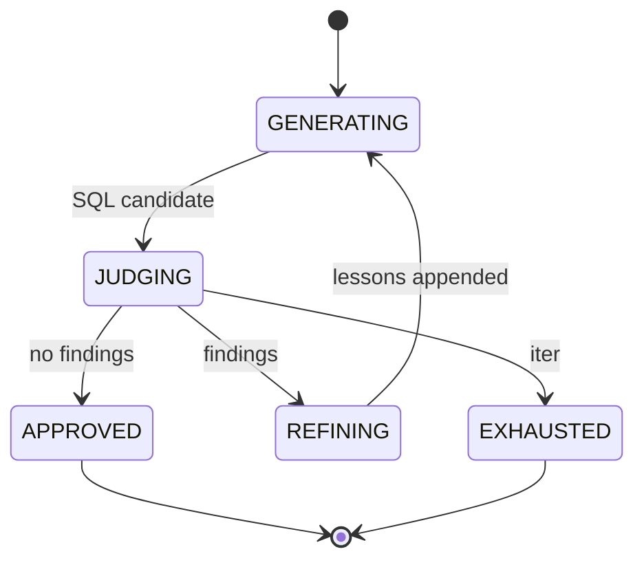

# SQL Generation & Security Audit System

MVP многоагентной системы: по NL-описанию задачи генерирует SQL-запрос для PostgreSQL, проводит аудит безопасности и итеративно исправляет до одобрения. Кейс 3 проектного практикума, заказчик — GreenData.

**Ключевой исследовательский вопрос:** как обеспечить, чтобы генератор действительно учился на замечаниях судьи между итерациями, а не повторял те же ошибки.

## Архитектура (стартовая гипотеза)

Гипотеза для kickstart. Подлежит пересмотру по результатам первых спринтов.

### Цикл

```mermaid
flowchart TD
    Input([NL-задача]) --> Gen
    Schema[(schema_index)] -.->|RAG context| Gen
    Gen[Generator] -->|SQL candidate| Judge
    Judge -->|findings| Decision
    Decision -->|no, iter < max| Memory[(critique_memory<br/>structured lessons)]
    Memory -.->|negative few-shot| Gen
    Decision -->|yes \| max_iters| Log[(audit_log)]
    Log --> Final([Final SQL + report])
```

### Состояния оркестратора



### Компоненты

**`schema_index`** — парсинг DDL тестовой БД GreenData в машиночитаемое представление: таблицы, колонки, типы, внешние ключи, разметка чувствительных полей (`password_hash`, `token`, `ssn`, `card_number` и т.п.). Используется как контекст для RAG и как ground truth для семантической валидации.

**`generator`** — формирует SQL по NL-описанию. Стартовый подход: prompt engineering + RAG над `schema_index`. Fine-tuning держим как fallback при провале по Execution Accuracy. На вход получает задачу, релевантный срез схемы и накопленную critique memory.

**`judge`** — два слоя за единым интерфейсом (defense in depth):

- *Static layer* — детерминированные проверки: AST/regex на классические паттерны (`SELECT *`, `DELETE`/`UPDATE` без `WHERE`, конкатенация пользовательского ввода), анализ `EXPLAIN` для оценки тяжести.
- *LLM layer* — классификация уязвимостей с пояснением и оценкой риска 0–10 для случаев, где правила не дают сигнала или нужен контекст схемы.

Выходной контракт — список `Finding(vulnerability_class, risk, explanation, location, suggested_fix)`.

**`critique_memory`** — ключевой компонент для ответа на исследовательский вопрос. Накапливает не сырой текст замечаний, а структурированные уроки: каких паттернов избегать, какие конструкции применять, какие чувствительные поля не запрашивать. Подмешивается в промпт генератора как negative few-shot. Без этого слоя генератор стабильно забывает предыдущие итерации.

**`orchestrator`** — конечный автомат: `GENERATING -> JUDGING -> (APPROVED | REFINING | EXHAUSTED)`. Управляет лимитом итераций, политикой остановки, передачей состояния между компонентами. Не знает о конкретных LLM — общается только через интерфейсы `Generator` и `Judge`.

**`audit_log`** — event-sourced лог: каждое действие (генерация, замечание, исправление, одобрение) фиксируется как событие с timestamp и payload. Из него собирается отчёт для пользователя и метрики для оффлайн-оценки.

**`evaluator`** — оффлайн-пайплайн: Execution Accuracy на dev-наборе, среднее число итераций, динамика снижения риска, разбор ошибок по классам.

### Принципы

- **Контракты через Pydantic-модели** — типизированные `SqlCandidate`, `Finding`, `CritiqueLesson`. Связность между компонентами минимальна.
- **Strategy для метода генерации** — prompt / RAG / fine-tuned взаимозаменяемы за одним интерфейсом.
- **Judge как pipeline, а не монолит** — статические правила выполняются всегда (дёшево, детерминированно, объяснимо), LLM подключается поверх. По возможности классифицировать на уровне правил, а не модели.
- **Critique-as-data, а не critique-as-prompt** — замечания судьи проходят через слой нормализации в структурированные уроки до подачи в генератор.
- **Система не исполняет запросы** — цикл завершается одобрением или исчерпанием лимита.

### Открытые вопросы для первых спринтов

- Достаточно ли `prompt + RAG` для целевой Execution Accuracy или нужен fine-tuning.
- Какая стратегия передачи critique history лучше: полный лог, summary, структурированные уроки.
- Где провести границу между static и LLM judge — какие классы уязвимостей закрывать чем.
- Запускать ли `EXPLAIN` на локальной копии схемы (без данных) как часть judge.

## Стек

- Python 3.10+
- PostgreSQL (обязательный диалект; Oracle / MS SQL — опционально)
- LLM API: OpenAI / YandexGPT / локальная модель
- RAG: LangChain или аналог
- Интерфейс: Streamlit / FastAPI / CLI / Telegram-бот — на выбор

## Покрываемые классы уязвимостей

| Класс                                                     | Риск |
| --------------------------------------------------------- | ---- |
| SQL Injection (классический)                              | 10   |
| Union-based Injection                                     | 9    |
| `UPDATE` / `DELETE` без `WHERE`                           | 9    |
| PL/pgSQL: небезопасный `EXECUTE format(...)` без `USING`  | 9    |
| Time-based blind Injection (`pg_sleep`)                   | 8    |
| Privilege Escalation через `EXECUTE` в `SECURITY DEFINER` | 8    |
| Прямой доступ к чувствительным полям                      | 6    |
| Избыточный `SELECT *`                                     | 5    |
| Отсутствие `LIMIT` / пагинации                            | 4    |

## Целевые метрики

- Execution Accuracy ≥ 70% на тестовом наборе.
- Доля одобренных запросов и среднее число итераций до одобрения.
- Динамика снижения оценки риска по итерациям.
- Полный цикл — ориентир ≤ 30–40 секунд.

## Артефакты

- Машиночитаемое представление схемы тестовой БД GreenData.
- Датасет пар «NL -> SQL»: безопасные эталоны + примеры с типичными уязвимостями.
- Прозрачный лог аудита: финальный запрос, найденные риски, ход устранения, число итераций.
- Сравнительный кейс «уязвимая исходная версия -> одобренный финал».
- Отчёт: архитектура, метрики, анализ ошибок, направления развития.
- Live-demo и презентация для защиты.

## Ограничения

- Тестовая база содержит условно конфиденциальные данные.
- Прямого доступа к боевой БД нет; локальное развёртывание схемы допустимо.
- Запросы не исполняются системой автоматически.

## Антипаттерны

- Судья указывает «запрос плохой» без классификации и пояснений.
- Генератор после замечания не исправляет запрос или ухудшает его.
- Воспроизведение одних и тех же ошибок между итерациями.
- Исполнение запроса до прохождения аудита.